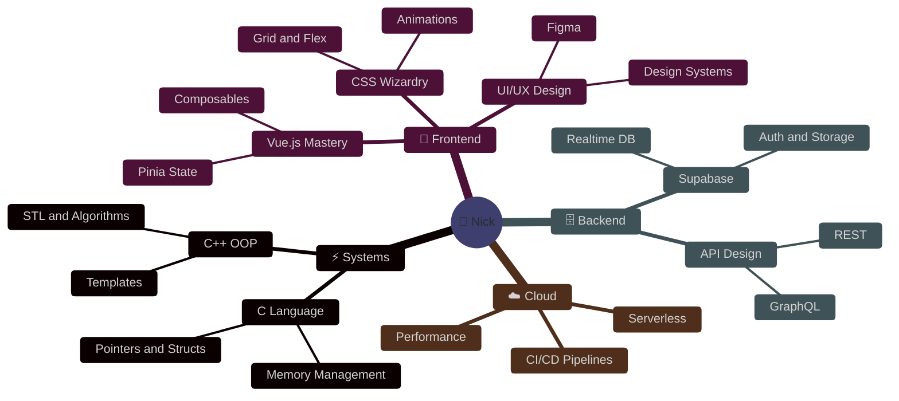

<!-- ============================================================
     NGO HUU LOC — GITHUB PROFILE README
     ============================================================ -->

<div align="center">

<!-- ░░░ ANIMATED HEADER BANNER ░░░ -->


<!-- ░░░ TYPING SVG ░░░ -->


<br>

<!-- ░░░ SOCIAL BADGES ░░░ -->
[](https://github.com/NgoHuuLoc0612)
[](https://github.com/NgoHuuLoc0612)
[](https://twitter.com/benhan871986)

</div>

---

<!-- ░░░░░░░░░░░░░░░░░░░░░░░░░░░░░░░░░░░░░░░░░░
     SECTION 1 — INTERACTIVE TERMINAL
     ⚠️  GitHub strips JS — terminal is hosted
         on Vercel and embedded via iframe link.
         Replace nick-terminal.vercel.app below after deploy.
░░░░░░░░░░░░░░░░░░░░░░░░░░░░░░░░░░░░░░░░░░ -->

<div align="center">

### 💻 Interactive Terminal

<!-- Live terminal badge — click to open -->
[](https://nick-terminal.vercel.app)

<!-- Terminal preview screenshot — generated by GitHub Actions (see .github/workflows/terminal-screenshot.yml) -->
<!-- Replace the line below with your actual Vercel URL after deploy -->
<a href="https://nick-terminal.vercel.app" target="_blank">
  
</a>

<!-- Fallback ASCII preview (always visible on GitHub) -->
```
┌─────────────────────────────────────────────────────────────────────┐
│  nick@universe — zsh                                  ● ● ●        │
├─────────────────────────────────────────────────────────────────────┤
│                                                                     │
│  nick@universe ❯ whoami                                             │
│                                                                     │
│  ╔══════════════════════════════════════════╗                       │
│  ║  NGO HUU LOC  (Nick)                    ║                       │
│  ╚══════════════════════════════════════════╝                       │
│                                                                     │
│  Role      ─  Full-Stack Engineer                                   │
│  Location  ─  Vietnam 🇻🇳                                          │
│  Status    ─  ● ONLINE  Building something epic                     │
│  Motto     ─  "Choose to become extraordinary"                      │
│                                                                     │
│  nick@universe ❯ █                                                  │
│                                                                     │
│  [ help ] [ whoami ] [ skills ] [ projects ] [ matrix ] [ clear ]  │
└─────────────────────────────────────────────────────────────────────┘
```

> 🚀 **[Click here to open the live interactive terminal →](https://nick-terminal.vercel.app)**
> Type `help` • `whoami` • `skills` • `projects` • `matrix` and more!

</div>

---

<!-- ░░░░░░░░░░░░░░░░░░░░░░░░░░░░░░░░░░░░░░░░░░
     SECTION 2 — GITHUB STATS
░░░░░░░░░░░░░░░░░░░░░░░░░░░░░░░░░░░░░░░░░░ -->

<div align="center">

### 📊 GitHub Universe


<br><br>


</div>

---

<!-- ░░░░░░░░░░░░░░░░░░░░░░░░░░░░░░░░░░░░░░░░░░
     SECTION 3 — 3D CONTRIBUTION GRAPH
░░░░░░░░░░░░░░░░░░░░░░░░░░░░░░░░░░░░░░░░░░ -->

<div align="center">

### 🌐 3D Contribution Landscape

<picture>
  <source media="(prefers-color-scheme: dark)" srcset="https://raw.githubusercontent.com/NgoHuuLoc0612/NgoHuuLoc0612/output/github-snake-dark.svg" />
  <source media="(prefers-color-scheme: light)" srcset="https://raw.githubusercontent.com/NgoHuuLoc0612/NgoHuuLoc0612/output/github-snake.svg" />
  
</picture>

<br>


</div>

---

<!-- ░░░░░░░░░░░░░░░░░░░░░░░░░░░░░░░░░░░░░░░░░░
     SECTION 4 — TROPHY WALL
░░░░░░░░░░░░░░░░░░░░░░░░░░░░░░░░░░░░░░░░░░ -->

<div align="center">

### 🏆 Trophy Wall


</div>

---

<!-- ░░░░░░░░░░░░░░░░░░░░░░░░░░░░░░░░░░░░░░░░░░
     SECTION 5 — TECH STACK
░░░░░░░░░░░░░░░░░░░░░░░░░░░░░░░░░░░░░░░░░░ -->

<div align="center">

### 🚀 Technology Arsenal

**⚙️ Systems & Low-Level**


<br>

**🎨 Frontend & Design**


<br>

**🗄️ Backend & Infrastructure**


<br>

**📊 Skill Proficiency**

```
╔══════════════════════════════════════════════════════════════╗
║  Skill               Level    Progress                       ║
╠══════════════════════════════════════════════════════════════╣
║  Frontend Dev        ■ 95%   ████████████████████░   🔥     ║
║  UI/UX Design        ■ 85%   ████████████████░░░░░   ⚡     ║
║  C / C++             ■ 75%   ██████████████░░░░░░░   🛡️     ║
║  Python              ■ 80%   ████████████████░░░░░   🐍     ║
║  Systems Design      ■ 70%   █████████████░░░░░░░░   🏗️     ║
╚══════════════════════════════════════════════════════════════╝
```

</div>

---

<!-- ░░░░░░░░░░░░░░░░░░░░░░░░░░░░░░░░░░░░░░░░░░
     SECTION 6 — ACTIVITY GRAPH
░░░░░░░░░░░░░░░░░░░░░░░░░░░░░░░░░░░░░░░░░░ -->

<div align="center">

### 📈 Activity Graph


</div>

---

<!-- ░░░░░░░░░░░░░░░░░░░░░░░░░░░░░░░░░░░░░░░░░░
     SECTION 7 — MIND MAP
░░░░░░░░░░░░░░░░░░░░░░░░░░░░░░░░░░░░░░░░░░ -->

<div align="center">

### 🧠 Mind Architecture



</div>

---

<!-- ░░░░░░░░░░░░░░░░░░░░░░░░░░░░░░░░░░░░░░░░░░
     SECTION 8 — LIVE METRICS
░░░░░░░░░░░░░░░░░░░░░░░░░░░░░░░░░░░░░░░░░░ -->

<div align="center">

### ⚡ Live Metrics


</div>

---

<!-- ░░░░░░░░░░░░░░░░░░░░░░░░░░░░░░░░░░░░░░░░░░
     SECTION 9 — QUOTE & CONNECT
░░░░░░░░░░░░░░░░░░░░░░░░░░░░░░░░░░░░░░░░░░ -->

<div align="center">

### 💭 Philosophy


<br>

---

### 🌐 Connect

[](https://github.com/NgoHuuLoc0612)
[](https://twitter.com/benhan871986)
[](https://nick-terminal.vercel.app)

---


<sub>⚡ Powered by passion, caffeine & extraordinary ambition · Auto-updated: 2026-04-20 03:57:19 UTC</sub>

</div>
