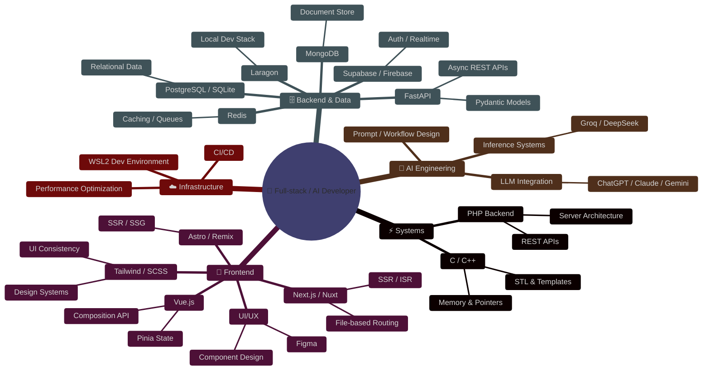

<!-- ============================================================
     NGO HUU LOC — GITHUB PROFILE README
     ============================================================ -->

<!-- ░░░ ANIMATED HEADER BANNER ░░░ -->

<!-- ░░░ TYPING SVG ░░░ -->

 

<!-- ░░░ SOCIAL BADGES ░░░ -->

---

<!-- ░░░░░░░░░░░░░░░░░░░░░░░░░░░░░░░░░░░░░░░░░░
     SECTION 1 — INTERACTIVE TERMINAL
     ⚠️  GitHub strips JS — terminal is hosted
         on Vercel and embedded via iframe link.
         Replace nick-terminal.vercel.app below after deploy.
░░░░░░░░░░░░░░░░░░░░░░░░░░░░░░░░░░░░░░░░░░ -->

### 💻 Interactive Terminal

<!-- Live terminal badge — click to open -->

<!-- Terminal preview screenshot — generated by GitHub Actions (see .github/workflows/terminal-screenshot.yml) -->
<!-- Replace the line below with your actual Vercel URL after deploy -->

> 🚀 **[Click here to open the live interactive terminal →](https://nick-terminal.vercel.app)**
> Type `help` • `whoami` • `skills` • `projects` • `matrix` and more!

<!-- ░░░░░░░░░░░░░░░░░░░░░░░░░░░░░░░░░░░░░░░░░░
     SECTION 3 — 3D CONTRIBUTION GRAPH
░░░░░░░░░░░░░░░░░░░░░░░░░░░░░░░░░░░░░░░░░░ -->

### 🌐 3D Contribution Landscape

<picture>
  <source media="(prefers-color-scheme: dark)" srcset="https://raw.githubusercontent.com/NgoHuuLoc0612/NgoHuuLoc0612/output/github-snake-dark.svg" />
  <source media="(prefers-color-scheme: light)" srcset="https://raw.githubusercontent.com/NgoHuuLoc0612/NgoHuuLoc0612/output/github-snake.svg" />
  
</picture>

 

---

<!-- ░░░░░░░░░░░░░░░░░░░░░░░░░░░░░░░░░░░░░░░░░░
     SECTION 4 — TROPHY WALL
░░░░░░░░░░░░░░░░░░░░░░░░░░░░░░░░░░░░░░░░░░ -->

### 🏆 Trophy Wall

---

<!-- ░░░░░░░░░░░░░░░░░░░░░░░░░░░░░░░░░░░░░░░░░░
     SECTION 5 — TECH STACK
░░░░░░░░░░░░░░░░░░░░░░░░░░░░░░░░░░░░░░░░░░ -->

### Gitroll

### 🚀 Technology Arsenal

**⚙️ Systems & Low-Level**

 

**🎨 Frontend & Design**

 

**🛠️ Tools & DevOps**

 

**🌐 APIs & Networking**

 

**🔒 Security**

 

**🗄️ Backend & Infrastructure**

 

**🤖 AI and Data**

 

**🪟 Operating system currently in use**

---

<!-- ░░░░░░░░░░░░░░░░░░░░░░░░░░░░░░░░░░░░░░░░░░
     SECTION 6 — ACTIVITY GRAPH
░░░░░░░░░░░░░░░░░░░░░░░░░░░░░░░░░░░░░░░░░░ -->

### 📈 Activity Graph

---

<!-- ░░░░░░░░░░░░░░░░░░░░░░░░░░░░░░░░░░░░░░░░░░
     SECTION 7 — MIND MAP
░░░░░░░░░░░░░░░░░░░░░░░░░░░░░░░░░░░░░░░░░░ -->

### 🧠 Mind Architecture

---

Counting of visitors to this page

<!-- ░░░░░░░░░░░░░░░░░░░░░░░░░░░░░░░░░░░░░░░░░░
     SECTION 8 — LIVE METRICS
░░░░░░░░░░░░░░░░░░░░░░░░░░░░░░░░░░░░░░░░░░ -->

### ⚡ Live Metrics

---

<!-- ░░░░░░░░░░░░░░░░░░░░░░░░░░░░░░░░░░░░░░░░░░
     SECTION 9 — QUOTE & CONNECT
░░░░░░░░░░░░░░░░░░░░░░░░░░░░░░░░░░░░░░░░░░ -->

### 💭 Philosophy

 

---

### 🌐 Connect

---

⚡ Powered by passion, caffeine & extraordinary ambition · Auto-updated: 2026-05-31 00:00:00 UTC

